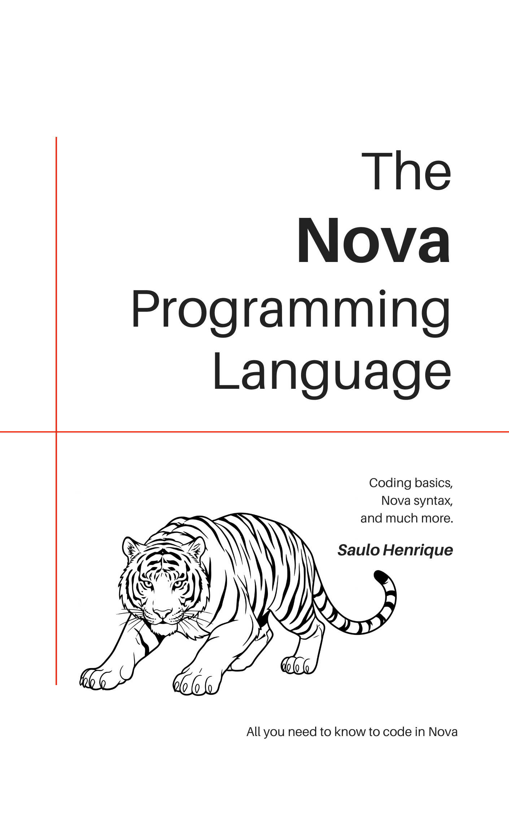

<style>
@import url('https://fonts.googleapis.com/css2?family=Inter:wght@300;400;500;600&family=DM+Serif+Display:ital@0;1&family=JetBrains+Mono:wght@400;500&display=swap');

:root {
  --preto:       #000000;
  --texto:       #0d0d0d;
  --medio:       #3a3a3a;
  --suave:       #6b6b6b;
  --linha:       #d4d4d4;
  --linha-leve:  #ebebeb;
  --fundo:       #ffffff;
  --fundo-code:  #f6f6f6;
}

*, *::before, *::after { box-sizing: border-box; margin: 0; padding: 0; }

html { font-size: 16px; }

body {
  font-family: 'Inter', -apple-system, BlinkMacSystemFont, sans-serif;
  font-size: 1rem;
  font-weight: 400;
  line-height: 1.8;
  color: var(--texto);
  background: var(--fundo);
  -webkit-font-smoothing: antialiased;
  -moz-osx-font-smoothing: grayscale;
  text-rendering: optimizeLegibility;
  font-feature-settings: "kern" 1, "liga" 1, "ss01" 1;
}

/* ── LAYOUT ─────────────────────────────────────────────────── */

.capa {
  width: 100%;
  display: block;
}

article {
  max-width: 660px;
  margin: 0 auto;
  padding: 5rem 2rem 8rem;
}

/* ── PARÁGRAFOS ──────────────────────────────────────────────── */

p {
  margin: 0;
  text-indent: 1.4em;
  hyphens: auto;
  -webkit-hyphens: auto;
  color: var(--texto);
  font-size: 1rem;
  font-weight: 400;
  line-height: 1.8;
}

h1 + p, h2 + p, h3 + p, h4 + p,
blockquote + p, hr + p, .aviso + p, .nota + p {
  text-indent: 0;
}

/* ── DROP CAP ────────────────────────────────────────────────── */

p.dropcap { text-indent: 0; }

p.dropcap::first-letter {
  font-family: 'DM Serif Display', Georgia, serif;
  font-size: 4.2em;
  font-weight: 400;
  color: var(--preto);
  float: left;
  line-height: 0.82;
  margin-top: 0.08em;
  margin-right: 0.05em;
  margin-bottom: -0.1em;
  padding: 0;
}

/* ── TÍTULOS ─────────────────────────────────────────────────── */

h1 {
  font-family: 'DM Serif Display', Georgia, serif;
  font-size: 2.25rem;
  font-weight: 400;
  color: var(--preto);
  text-align: left;
  letter-spacing: -0.02em;
  line-height: 1.15;
  margin-top: 5rem;
  margin-bottom: 2rem;
  padding-bottom: 1.25rem;
  border-bottom: 1px solid var(--preto);
}

h1 .label {
  display: block;
  font-family: 'Inter', sans-serif;
  font-size: 0.65rem;
  font-weight: 600;
  letter-spacing: 0.16em;
  text-transform: uppercase;
  color: var(--suave);
  margin-bottom: 0.6rem;
}

h2 {
  font-family: 'Inter', sans-serif;
  font-size: 0.7rem;
  font-weight: 600;
  letter-spacing: 0.14em;
  text-transform: uppercase;
  color: var(--suave);
  margin-top: 3.5rem;
  margin-bottom: 0.9rem;
  padding-bottom: 0.5rem;
  border-bottom: 1px solid var(--linha-leve);
}

h3 {
  font-family: 'Inter', sans-serif;
  font-size: 0.95rem;
  font-weight: 600;
  color: var(--texto);
  margin-top: 2.5rem;
  margin-bottom: 0.5rem;
  letter-spacing: -0.01em;
}

h4 {
  font-family: 'Inter', sans-serif;
  font-size: 0.8rem;
  font-weight: 500;
  color: var(--medio);
  margin-top: 1.8rem;
  margin-bottom: 0.4rem;
  letter-spacing: 0.03em;
}

/* ── EPÍGRAFE ────────────────────────────────────────────────── */

blockquote.epigrafe {
  margin: 2.5rem 0 3rem 0;
  padding: 0 0 0 1.5rem;
  border-left: 2px solid var(--preto);
  font-family: 'DM Serif Display', Georgia, serif;
  font-style: italic;
  font-size: 1.1rem;
  color: var(--medio);
  line-height: 1.65;
}

blockquote.epigrafe cite {
  display: block;
  margin-top: 0.6rem;
  font-family: 'Inter', sans-serif;
  font-style: normal;
  font-size: 0.75rem;
  font-weight: 500;
  letter-spacing: 0.06em;
  text-transform: uppercase;
  color: var(--suave);
}

blockquote {
  margin: 1.8rem 0;
  padding: 0 0 0 1.5rem;
  border-left: 2px solid var(--linha);
  color: var(--medio);
  font-style: italic;
}

/* ── CÓDIGO INLINE ───────────────────────────────────────────── */

code {
  font-family: 'JetBrains Mono', 'SF Mono', 'Menlo', monospace;
  font-size: 0.8em;
  background: var(--fundo-code);
  color: var(--preto);
  padding: 0.15em 0.4em;
  border-radius: 3px;
  border: 1px solid var(--linha-leve);
  font-weight: 500;
}

/* ── BLOCO DE CÓDIGO ─────────────────────────────────────────── */

pre {
  background: var(--fundo-code);
  border: 1px solid var(--linha-leve);
  border-top: 2px solid var(--preto);
  border-radius: 0 0 4px 4px;
  padding: 1.25rem 1.4rem;
  margin: 2rem 0;
  overflow-x: auto;
  font-family: 'JetBrains Mono', monospace;
  font-size: 0.8rem;
  line-height: 1.7;
  color: var(--texto);
}

pre code {
  background: none;
  border: none;
  padding: 0;
  font-size: inherit;
  color: inherit;
  border-radius: 0;
  font-weight: 400;
}

/* ── CAIXAS ──────────────────────────────────────────────────── */

.nota, .aviso {
  margin: 2rem 0;
  padding: 1rem 1.25rem;
  font-size: 0.875rem;
  line-height: 1.65;
  color: var(--medio);
}

.nota {
  border: 1px solid var(--linha-leve);
  border-top: 2px solid var(--preto);
  border-radius: 0 0 3px 3px;
}

.nota::before {
  content: "NOTA";
  display: block;
  font-family: 'Inter', sans-serif;
  font-size: 0.62rem;
  font-weight: 700;
  letter-spacing: 0.14em;
  color: var(--preto);
  margin-bottom: 0.45rem;
}

.aviso {
  border: 1px solid var(--linha);
  border-top: 2px solid var(--medio);
  border-radius: 0 0 3px 3px;
}

.aviso::before {
  content: "ATENÇÃO";
  display: block;
  font-family: 'Inter', sans-serif;
  font-size: 0.62rem;
  font-weight: 700;
  letter-spacing: 0.14em;
  color: var(--medio);
  margin-bottom: 0.45rem;
}

/* ── HR ──────────────────────────────────────────────────────── */

hr {
  border: none;
  border-top: 1px solid var(--linha-leve);
  margin: 3rem 0;
}

/* ── LISTAS ──────────────────────────────────────────────────── */

ul, ol {
  padding-left: 1.5em;
  margin: 0.8rem 0;
}

li {
  margin-bottom: 0.25rem;
  font-size: 1rem;
  color: var(--texto);
}

li::marker { color: var(--suave); }

/* ── TABELAS ─────────────────────────────────────────────────── */

table {
  width: 100%;
  border-collapse: collapse;
  margin: 2rem 0;
  font-size: 0.875rem;
}

th {
  text-align: left;
  font-weight: 600;
  font-size: 0.65rem;
  letter-spacing: 0.1em;
  text-transform: uppercase;
  color: var(--suave);
  padding: 0.5rem 0.75rem;
  border-bottom: 1px solid var(--preto);
}

td {
  padding: 0.55rem 0.75rem;
  border-bottom: 1px solid var(--linha-leve);
  color: var(--medio);
}

/* ── LINKS ───────────────────────────────────────────────────── */

a {
  color: var(--preto);
  text-decoration: underline;
  text-decoration-thickness: 1px;
  text-underline-offset: 3px;
  text-decoration-color: var(--linha);
  transition: text-decoration-color 0.15s;
}

a:hover { text-decoration-color: var(--preto); }

/* ── PRINT ───────────────────────────────────────────────────── */

@media print {
  body { font-size: 10.5pt; }
  article { max-width: 100%; padding: 0; }
  pre, .nota, .aviso { break-inside: avoid; }
  h1, h2, h3 { break-after: avoid; }
}
</style>

<!--
═══════════════════════════════════════════════════════════════
  COMO USAR
═══════════════════════════════════════════════════════════════

  RENDERIZAÇÃO:
    - Obsidian, Typora, VS Code (Markdown Preview Enhanced)
    - Renomear para .html e abrir no navegador
    - pandoc livro.md -o livro.html --standalone

  DROP CAP:
    <p class="dropcap">Primeiro parágrafo do capítulo.</p>

  EPÍGRAFE:
    <blockquote class="epigrafe">
      Texto da epígrafe.
      <cite>— Autor</cite>
    </blockquote>

  NOTA:
    <div class="nota">Texto da nota.</div>

  AVISO:
    <div class="aviso">Texto do aviso.</div>

  LABEL DE CAPÍTULO:
    # <span class="label">Capítulo 1</span> Título do Capítulo
-->



<article>

# <span class="label">Prefácio</span> Antes de Começar

<p class="dropcap">Uma linguagem de programção nada mais é que uma forma mais "alto nível" de falar com o processador. Digitamos palavras parecidas com o inglês e o compilador as traduz pra uma.</p>

O que você encontrará nas páginas seguintes não é apenas um manual de referência, mas um guia para compreender os fundamentos e a intenção por trás de cada decisão de projeto.

---

# <span class="label">Capítulo 1</span> Introdução

<p class="dropcap">As linguagens de programação são ferramentas que moldam o pensamento. Quando você aprende uma nova linguagem, não está apenas adquirindo sintaxe — está internalizando uma forma de estruturar problemas.</p>

## Motivação

Texto da seção aqui. Parágrafo de exemplo para demonstrar a tipografia Inter em corpo de texto corrido, com espaçamento e ritmo vertical calibrados para leitura técnica prolongada.

<div class="nota">Esta é uma nota de destaque. Use para informações complementares que merecem atenção especial sem interromper o fluxo do texto.</div>

## Escopo deste Livro

Texto da seção aqui.

<div class="aviso">Este é um aviso. Use para alertas importantes, comportamentos inesperados ou pontos críticos que o leitor não deve ignorar.</div>

### Exemplo de bloco de código

```
// Exemplo de código na sua linguagem
funcao somar(a, b) {
  retornar a + b
}

resultado = somar(10, 32)
```

</article>

<!-- FIM DO EXEMPLO -->